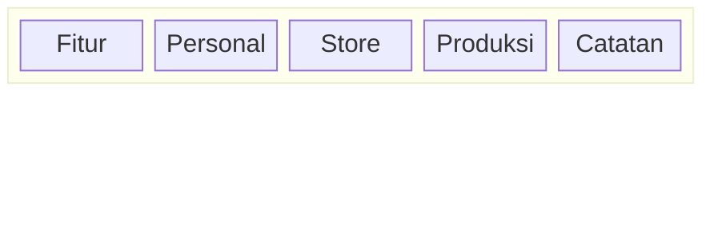

# Business Requirements Document (BRD)
## Cuan Flow — Aplikasi Pencatatan Keuangan UMKM

**Versi:** 2.1  
**Tanggal:** April 2026  
**Status:** In Development

---

## 1. Latar Belakang

Mayoritas pelaku UMKM dan individu di Indonesia masih mencatat keuangan secara manual (buku, notes HP) atau tidak mencatat sama sekali. Akibatnya:

- Tidak tahu apakah usaha untung atau rugi
- Uang "hilang" tanpa jejak
- Sulit membuat keputusan bisnis (restok barang, buka cabang, naikkan harga)
- Tidak bisa deteksi kebocoran pengeluaran

**Cuan Flow** hadir sebagai solusi pencatatan yang ringan, cepat, dan relevan untuk tiga segmen utama: **pengguna personal**, **pedagang/toko (store)**, dan **produsen rumahan (production)**.

---

## 2. Tujuan Bisnis

| Tujuan | Indikator Berhasil |
|---|---|
| User bisa catat transaksi < 10 detik | Quick Sale: 2 ketukan |
| User tahu kondisi keuangan hari ini | Home screen: laba/rugi hari ini |
| User tidak lupa utang/piutang | Modul Utang dengan notifikasi jatuh tempo |
| Pedagang tahu stok mana yang mau habis | Alert merah/kuning di Stok Barang |
| Produsen tahu HPP yang akurat | Kalkulator HPP + Batch Produksi |
| User bisa lihat laporan bulanan tanpa akuntansi | Laporan otomatis + export PDF |

---

## 3. Target Pengguna (Personas)

### Persona A — Pengguna Personal
**Mode:** `personal`  
**Siapa:** Karyawan, mahasiswa, ibu rumah tangga  
**Masalah:** Gaji habis sebelum akhir bulan, tidak tahu uang kemana  
**Tujuan:** Catat pemasukan & pengeluaran harian, pantau sisa uang

**Fitur yang dipakai:**
- Tambah pemasukan & pengeluaran
- Dompet & Rekening (pisah tabungan vs uang jajan)
- Utang & Piutang
- Transaksi Berulang
- Budget bulanan
- Laporan bulanan

---

### Persona B — Pedagang Kelontong / Warung
**Mode:** `store`  
**Siapa:** Pemilik warung kelontong, toko sembako, warung makan kecil  
**Masalah:** Tidak tahu omzet harian, stok sering habis tiba-tiba  
**Tujuan:** Catat penjualan cepat, pantau stok, tahu untung/rugi per hari

**Fitur tambahan (di atas Personal):**
- **Jual Cepat** — tap preset → langsung tercatat (killer feature)
- **Stok Barang** — pantau stok, alert kalau menipis
- **Analitik Produk** — statistik penjualan per item
- **Kategori Terlaris** — laporan kategori dengan omzet terbesar
- **Hari Tersibuk** — visualisasi omzet per hari dalam seminggu

> Mode store juga bisa mengaktifkan: **Budget**, **Multi-outlet**, dan **HPP & Produk** secara opsional.

---

### Persona C — Usaha Menengah (Multi-outlet)
**Mode:** `store` + `featureOutlets = true`  
**Siapa:** Pemilik beberapa cabang toko/warung, owner franchise kecil  
**Tujuan:** Pisahkan transaksi per outlet, bandingkan kinerja antar cabang

**Fitur tambahan:**
- **Kelola Outlet** — daftarkan tiap cabang
- **Filter riwayat per outlet**
- **Chart kontribusi outlet** — porsi pendapatan per cabang
- **Tren pendapatan per outlet** — grafik perbandingan bulanan

---

### Persona D — Produsen Kecil (Home Industry)
**Mode:** `production`  
**Siapa:** Pemilik usaha produksi rumahan (kue, makanan, kerajinan)  
**Masalah:** Tidak tahu HPP, sering jual rugi tanpa sadar, bahan baku tidak terpantau  
**Tujuan:** Hitung HPP akurat, catat batch produksi, pantau bahan baku

**Fitur yang dipakai:**
- **HPP & Produk** — input bahan baku + biaya → dapat HPP per unit
- **Bahan Baku** — daftar bahan baku dengan stok & harga per satuan
- **Batch Produksi** — catat setiap kali produksi (qty & bahan yang dipakai)
- **Analitik Produk** — margin per produk, breakeven analysis
- Utang & Piutang (aktif otomatis)
- Budget & Target (opsional)
- Multi-outlet (opsional)

---

## 4. Feature Map (Fitur vs Mode)



| Fitur | Personal | Store | Production | Catatan |
|---|:---:|:---:|:---:|---|
| Catat Pemasukan & Pengeluaran | ✅ | ✅ | ✅ | Core |
| Riwayat Transaksi | ✅ | ✅ | ✅ | Core |
| Laporan Bulanan + PDF | ✅ | ✅ | ✅ | Core |
| **Dompet & Rekening** | ✅ | ❌ | ❌ | Hanya personal |
| Transaksi Berulang | ✅ | ✅ | ✅ | Core |
| **Utang & Piutang** | ❌ | ❌ | ✅ | Feature flag `featureDebt` |
| **Budget Bulanan** | ❌ | opt | ✅ | Feature flag `featureBudget` |
| **Stok Barang** | ❌ | ✅ | ✅ | Feature flag `featureStock` |
| **Jual Cepat** | ❌ | ✅ | ❌ | Feature flag `featureQuickSale` |
| **Analitik Produk** | ❌ | ✅ | ✅ | Feature flag `featureProductAnalytics` |
| **Kategori Terlaris** | ❌ | ✅ | ❌ | Feature flag `featureTopCategories` |
| **Hari Tersibuk** | ❌ | ✅ | ❌ | Feature flag `featureBusiestDay` |
| **Kelola Outlet** | ❌ | opt | opt | Feature flag `featureOutlets` |
| **Chart Perbandingan Outlet** | ❌ | opt | opt | Hanya jika featureOutlets + ≥2 outlet |
| **HPP & Daftar Produk** | ❌ | opt | ✅ | Feature flag `featureProduct` |
| **Bahan Baku** | ❌ | ❌ | ✅ | Feature flag `featureProduction` |
| **Batch Produksi** | ❌ | ❌ | ✅ | Feature flag `featureProduction` |

> `opt` = opsional, bisa diaktifkan saat onboarding atau di **Pengaturan → Atur Fitur**

---

## 5. Business Rules

### 5.1 Mode & Feature Flag

Sistem berbasis **10 feature flag individual** yang bisa dikombinasi bebas. Mode hanyalah preset awal.

```
BusinessMode.personal  → semua flag OFF
BusinessMode.store     → quickSale, topCategories, busiestDay, stock, productAnalytics = ON
BusinessMode.production → product, outlets, budget, production, stock, productAnalytics, debt = ON
```

Setelah onboarding, user bisa ubah kapan saja di **Profil → Atur Fitur**.

**Feature flags:**

| Flag | Kunci | Deskripsi |
|---|---|---|
| `featureProduct` | HPP & Produk | Kalkulator HPP + daftar produk |
| `featureOutlets` | Multi-outlet | Kelola cabang |
| `featureBudget` | Budget | Target anggaran bulanan |
| `featureProduction` | Bahan Baku & Batch | Manajemen bahan baku + pencatatan batch |
| `featureQuickSale` | Jual Cepat | Preset penjualan cepat |
| `featureTopCategories` | Kategori Terlaris | Insight laporan |
| `featureBusiestDay` | Hari Tersibuk | Insight laporan |
| `featureStock` | Stok Barang | Inventori barang dagangan |
| `featureProductAnalytics` | Analitik Produk | Statistik & margin per produk |
| `featureDebt` | Utang & Piutang | Catatan hutang/piutang |

---

### 5.2 Kalkulasi Saldo
- Saldo dompet = `saldo_awal + Σ(pemasukan) - Σ(pengeluaran)` untuk dompet tersebut
- Tidak ada field "saldo tersimpan" — dihitung real-time dari transaksi
- Total saldo = jumlah semua dompet yang terdaftar

---

### 5.3 Transaksi Berulang
- Dieksekusi otomatis saat app dibuka
- Cek: `next_execute <= hari_ini` → buat transaksi baru → update `next_execute`
- Frekuensi: Harian / Mingguan / Bulanan (dengan pilih tanggal 1–28)

---

### 5.4 Stok Barang (Inventori)
- **Hijau (Aman):** `currentStock > minStock`
- **Kuning (Menipis):** `currentStock <= minStock AND minStock > 0`
- **Merah (Habis):** `currentStock <= 0`
- Update stok: manual (+1 / -1 / +10 dari UI)
- **Tidak** terhubung otomatis ke Jual Cepat

---

### 5.4b Dompet & Rekening
- Hanya tersedia untuk mode **personal** (`isBusinessMode = false`)
- Untuk bisnis: pencatatan kas tidak dipisah per dompet

---

### 5.5 Jual Cepat
- Tap preset → isi qty → konfirmasi → income tercatat
- Tidak mengurangi stok secara otomatis
- Pemilihan dompet di-disable sementara (`_kEnableWalletSelector = false`)

---

### 5.6 Utang & Piutang
- `iOwe` = saya berhutang ke orang lain
- `theyOwe` = orang lain berhutang ke saya
- Tandai lunas → data tetap tersimpan, hanya flag `is_paid = true`

---

### 5.7 Batch Produksi
- Setiap batch mencatat: produk, tanggal, qty yang dihasilkan, dan bahan baku yang dipakai
- `costPerUnit = totalMaterialCost / qtyProduced`
- Bahan baku dipilih dari daftar `raw_materials` milik user
- Batch **tidak** otomatis mengurangi stok bahan baku (manual update)

---

### 5.8 HPP Calculator (Produk)
- Input: nama produk, qty hasil, daftar bahan baku (nama + harga), biaya lain
- Output: total biaya, HPP per unit, margin (jika harga jual diisi)
- Data tersimpan di tabel `products` (bisa di-load ulang untuk referensi)

---

## 6. Non-Functional Requirements

| Aspek | Ketentuan |
|---|---|
| **Offline-first** | Semua data tersimpan lokal (JSON), sync ke Supabase saat online |
| **Keamanan** | PIN 6 digit untuk masuk app |
| **Bahasa** | Indonesia & English (toggle di Pengaturan) |
| **Platform** | Android (utama), iOS (secondary) |
| **Iklan** | Native Ad (Google Mobile Ads) di beberapa layar |

---

## 7. Out of Scope (Sengaja Tidak Dibangun)

| Yang Tidak Dibangun | Alasan |
|---|---|
| Barcode scanner untuk stok | Butuh hardware/kamera integration — scope POS |
| Payment gateway / QRIS integration | Butuh lisensi & backend payment — scope POS |
| Laporan pajak / PPh | Terlalu kompleks, bukan kebutuhan UMKM kecil |
| Multi-user / karyawan login | Manajemen permission kompleks |
| Stok otomatis berkurang saat jual | Perlu integrasi barcode — next phase |
| Dompet & Rekening untuk mode bisnis | Tidak relevan tanpa integrasi payment gateway / POS |
| Wallet selector di Jual Cepat | Overkill untuk pencatatan sederhana — ditunda |
| Pengurangan stok bahan baku otomatis saat batch | Butuh validasi stok yang lebih kompleks — next phase |
