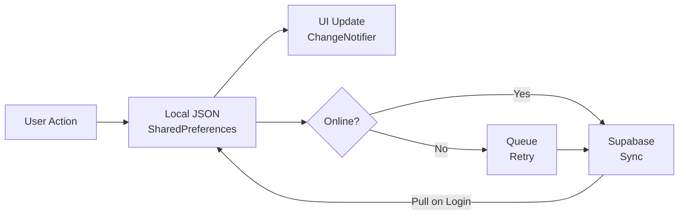

# Entity Relationship Diagram (ERD)
## Cuan Flow — Database Schema

**Versi:** 2.1 | **Tanggal:** April 2026

> Preview diagram: buka file ini di VSCode → klik kanan → **"Open Preview"**, atau tekan `Cmd+Shift+V` (Mac) / `Ctrl+Shift+V` (Windows).  
> Butuh ekstensi **Markdown Preview Mermaid Support** (ID: `bierner.markdown-mermaid`) jika diagram tidak tampil.

---

## Diagram Relasi

```mermaid
erDiagram
    users ||--|| profiles : "has"
    users ||--o{ transactions : "records"
    users ||--o{ wallets : "owns"
    users ||--o{ debts : "tracks"
    users ||--o{ recurring_transactions : "schedules"
    users ||--o{ inventory_items : "stocks"
    users ||--o{ quick_sale_presets : "sets"
    users ||--o{ user_categories : "defines"
    users ||--o{ budgets : "budgets"
    users ||--o{ products : "creates"
    users ||--o{ raw_materials : "manages"
    users ||--o{ production_batches : "produces"
    users ||--o{ outlets : "operates"

    transactions }o--o| outlets : "tagged outlet_id"
    transactions }o--o| wallets : "from wallet_id"

    quick_sale_presets }o--o| outlets : "for outlet_id"
    quick_sale_presets }o--o| wallets : "to wallet_id"

    budgets }o--o| user_categories : "per category_id"

    production_batches }o--|| products : "produces product_id"
    production_batches ||--|{ batch_materials : "uses"
    batch_materials }o--|| raw_materials : "consumes raw_material_id"

    users {
        uuid id PK
        text email
    }

    profiles {
        uuid id PK_FK
        text owner_name
        text business_name
        text whatsapp
        bool feature_product
        bool feature_outlets
        bool feature_budget
        bool feature_production
        bool feature_quick_sale
        bool feature_top_categories
        bool feature_busiest_day
        bool feature_stock
        bool feature_product_analytics
        bool feature_debt
        bool onboarding_complete
    }

    transactions {
        uuid id PK
        uuid user_id FK
        text type
        int amount
        text category
        text note
        uuid outlet_id FK
        text wallet_id FK
        timestamptz effective_date
        timestamptz created_at
    }

    wallets {
        uuid id PK
        uuid user_id FK
        text name
        text type
        int initial_balance
        bool is_default
        timestamptz created_at
    }

    debts {
        uuid id PK
        uuid user_id FK
        text person_name
        int amount
        text type
        bool is_paid
        text notes
        timestamptz due_date
        timestamptz created_at
    }

    recurring_transactions {
        uuid id PK
        uuid user_id FK
        text name
        int amount
        text type
        text category
        text frequency
        int day_of_month
        text wallet_id FK
        bool is_active
        timestamptz next_execute
        timestamptz last_executed
        timestamptz created_at
    }

    inventory_items {
        uuid id PK
        uuid user_id FK
        text name
        text unit
        numeric current_stock
        numeric min_stock
        int cost_price
        int sell_price
        text category
        timestamptz created_at
    }

    quick_sale_presets {
        uuid id PK
        uuid user_id FK
        text name
        int sell_price
        text category
        text note
        text wallet_id FK
        uuid outlet_id FK
        int sort_order
    }

    user_categories {
        text id PK
        uuid user_id FK
        text name
        text type
        bool is_stock_purchase
    }

    budgets {
        uuid id PK
        uuid user_id FK
        text type
        text category_id FK
        int target_amount
        text month
        timestamptz created_at
    }

    products {
        uuid id PK
        uuid user_id FK
        text name
        int yield_qty
        text yield_unit
        int selling_price
        json ingredients
        json other_costs
        timestamptz created_at
    }

    raw_materials {
        text id PK
        uuid user_id FK
        text name
        text unit
        double current_stock
        double min_stock
        double cost_per_unit
        text supplier_name
        text category
        timestamptz created_at
    }

    production_batches {
        text id PK
        uuid user_id FK
        text product_id FK
        text product_name
        datetime date
        double qty_produced
        text notes
        timestamptz created_at
    }

    batch_materials {
        text raw_material_id FK
        text raw_material_name
        double quantity
        text unit
        double cost_per_unit
    }

    outlets {
        uuid id PK
        uuid user_id FK
        text name
        text address
        bool is_default
        timestamptz created_at
    }
```

---

## Penjelasan Tiap Tabel

### `users` (Supabase Auth)
Dikelola sepenuhnya oleh Supabase Auth. App hanya pakai `id` sebagai foreign key.

---

### `profiles`
Ekstensi data user. Satu user = satu profil. Menyimpan semua feature flags.

| Kolom | Tipe | Keterangan |
|---|---|---|
| `id` | UUID (FK) | Sama dengan `auth.users.id` |
| `owner_name` | TEXT | Nama pemilik |
| `business_name` | TEXT | Nama usaha (opsional) |
| `whatsapp` | TEXT | Nomor WA |
| `feature_product` | BOOL | HPP Calculator & Product List |
| `feature_outlets` | BOOL | Multi-outlet management |
| `feature_budget` | BOOL | Budget & monthly targets |
| `feature_production` | BOOL | Bahan Baku & Batch Produksi |
| `feature_quick_sale` | BOOL | Jual Cepat |
| `feature_top_categories` | BOOL | Insight: Kategori Terlaris |
| `feature_busiest_day` | BOOL | Insight: Hari Tersibuk |
| `feature_stock` | BOOL | Stok Barang (Inventory) |
| `feature_product_analytics` | BOOL | Analitik Produk |
| `feature_debt` | BOOL | Utang & Piutang |
| `onboarding_complete` | BOOL | Sudah lewat layar pilih mode? |

---

### `transactions`
Inti dari app — semua pemasukan & pengeluaran.

| Kolom | Tipe | Keterangan |
|---|---|---|
| `id` | UUID | Auto-generate |
| `user_id` | UUID (FK) | |
| `type` | TEXT | `'income'` atau `'expense'` |
| `amount` | INTEGER | Dalam Rupiah (tanpa desimal) |
| `category` | TEXT | Nama kategori |
| `note` | TEXT | Keterangan |
| `outlet_id` | UUID (FK, null) | Hanya jika `featureOutlets` aktif |
| `wallet_id` | TEXT (null) | Referensi ke dompet |
| `effective_date` | TIMESTAMPTZ | Tanggal transaksi (bisa backdate) |
| `created_at` | TIMESTAMPTZ | Waktu input |

> `wallet_id` tersimpan lokal tetapi belum di-sync ke server (payload sync belum include).

---

### `wallets`
Dompet/rekening user. Hanya aktif untuk mode personal.

| Kolom | Tipe | Nilai |
|---|---|---|
| `type` | TEXT | `'cash'` / `'bank'` / `'ewallet'` |
| `initial_balance` | INTEGER | Saldo awal saat dompet dibuat |
| `is_default` | BOOL | Dompet yang otomatis dipilih |

**Saldo aktual** = `initial_balance + Σ income - Σ expense` untuk `wallet_id` tersebut.

---

### `debts`
Catatan utang & piutang. Aktif jika `featureDebt = true`.

| Kolom | Tipe | Nilai |
|---|---|---|
| `type` | TEXT | `'iOwe'` = saya berhutang / `'theyOwe'` = mereka berhutang |
| `is_paid` | BOOL | Lunas atau belum (data tidak dihapus) |
| `due_date` | TIMESTAMPTZ | Jatuh tempo (opsional) |

---

### `recurring_transactions`
Template transaksi yang berjalan otomatis saat app dibuka.

| Kolom | Tipe | Nilai |
|---|---|---|
| `frequency` | TEXT | `'daily'` / `'weekly'` / `'monthly'` |
| `day_of_month` | INTEGER | 1–28, hanya untuk monthly |
| `is_active` | BOOL | Pause/resume |
| `next_execute` | TIMESTAMPTZ | Kapan berikutnya akan berjalan |
| `last_executed` | TIMESTAMPTZ | Terakhir kali dieksekusi |

---

### `inventory_items`
Stok barang toko. Aktif jika `featureStock = true`.

| Kolom | Tipe | Keterangan |
|---|---|---|
| `current_stock` | NUMERIC | Stok saat ini |
| `min_stock` | NUMERIC | Batas minimum (trigger alert) |
| `cost_price` | INTEGER | Harga beli / HPP |
| `sell_price` | INTEGER | Harga jual |

---

### `quick_sale_presets`
Template penjualan cepat. Aktif jika `featureQuickSale = true`. Urutan diatur via `sort_order`.

---

### `user_categories`
Kategori custom buatan user.

| Kolom | Tipe | Nilai |
|---|---|---|
| `type` | TEXT | `'income'` atau `'expense'` |
| `is_stock_purchase` | BOOL | Tandai sebagai pembelian stok |

> `id` bertipe TEXT (bukan UUID) — legacy dari versi lama app.

---

### `budgets`
Target pemasukan atau batas pengeluaran per bulan. Aktif jika `featureBudget = true`.

| Kolom | Tipe | Keterangan |
|---|---|---|
| `type` | TEXT | `'income'` atau `'expense'` |
| `category_id` | TEXT (null) | Null = berlaku untuk semua kategori |
| `target_amount` | INTEGER | Nominal target/batas |
| `month` | TEXT | Format `'YYYY-MM'` |

---

### `products`
Hasil kalkulasi HPP. Aktif jika `featureProduct = true`.

| Kolom | Tipe | Keterangan |
|---|---|---|
| `yield_qty` | INTEGER | Jumlah unit yang dihasilkan |
| `ingredients` | JSONB | Array bahan baku + harga (`[{name, price}]`) |
| `other_costs` | JSONB | Array biaya tambahan (`[{name, amount}]`) |
| `selling_price` | INTEGER | Harga jual per unit |

---

### `raw_materials`
Daftar bahan baku untuk mode produksi. Aktif jika `featureProduction = true`.

| Kolom | Tipe | Keterangan |
|---|---|---|
| `id` | TEXT | ID lokal (timestamp + random) |
| `name` | TEXT | Nama bahan baku |
| `unit` | TEXT | Satuan (kg, liter, pcs, dll) |
| `current_stock` | DOUBLE | Stok saat ini |
| `min_stock` | DOUBLE | Minimum stok (trigger alert) |
| `cost_per_unit` | DOUBLE | Harga per satuan |
| `supplier_name` | TEXT | Nama supplier (opsional) |
| `category` | TEXT | Kategori bahan (opsional) |

**Status stok:**
- Habis: `currentStock <= 0`
- Menipis: `!isOutOfStock && minStock > 0 && currentStock <= minStock`
- Aman: selainnya

---

### `production_batches`
Catatan setiap kali produksi dilakukan. Aktif jika `featureProduction = true`.

| Kolom | Tipe | Keterangan |
|---|---|---|
| `id` | TEXT | ID lokal |
| `product_id` | TEXT (FK) | Referensi ke `products.id` |
| `product_name` | TEXT | Snapshot nama produk |
| `date` | DATETIME | Tanggal produksi |
| `qty_produced` | DOUBLE | Jumlah unit yang diproduksi |
| `notes` | TEXT | Catatan opsional |

**`batch_materials`** (embedded sebagai JSON array di dalam batch):

| Field | Tipe | Keterangan |
|---|---|---|
| `rawMaterialId` | TEXT | Referensi ke `raw_materials.id` |
| `rawMaterialName` | TEXT | Snapshot nama bahan |
| `quantity` | DOUBLE | Jumlah yang dipakai |
| `unit` | TEXT | Satuan |
| `costPerUnit` | DOUBLE | Harga per satuan saat produksi |

**Kalkulasi:** `costPerUnit = totalMaterialCost / qtyProduced`

---

### `outlets`
Cabang / outlet bisnis. Aktif jika `featureOutlets = true`.

| Kolom | Tipe | Keterangan |
|---|---|---|
| `name` | TEXT | Nama outlet |
| `address` | TEXT | Alamat (opsional) |
| `is_default` | BOOL | Outlet default saat input transaksi |

---

## Storage Architecture



**Prinsip:**
- Local JSON = source of truth untuk UI
- Supabase = backup & sync antar device
- App selalu bisa dipakai offline
- ID lokal diganti UUID server setelah sync berhasil
