# User Flow & Business Flow
## Cuan Flow — Panduan Penggunaan per Persona

**Versi:** 2.1 | **Tanggal:** April 2026

> Preview diagram: buka file ini di VSCode → klik kanan → **"Open Preview"**, atau tekan `Cmd+Shift+V` (Mac) / `Ctrl+Shift+V` (Windows).  
> Butuh ekstensi **Markdown Preview Mermaid Support** (ID: `bierner.markdown-mermaid`) jika diagram tidak tampil.

---

## 1. Alur Onboarding (Pertama Kali)

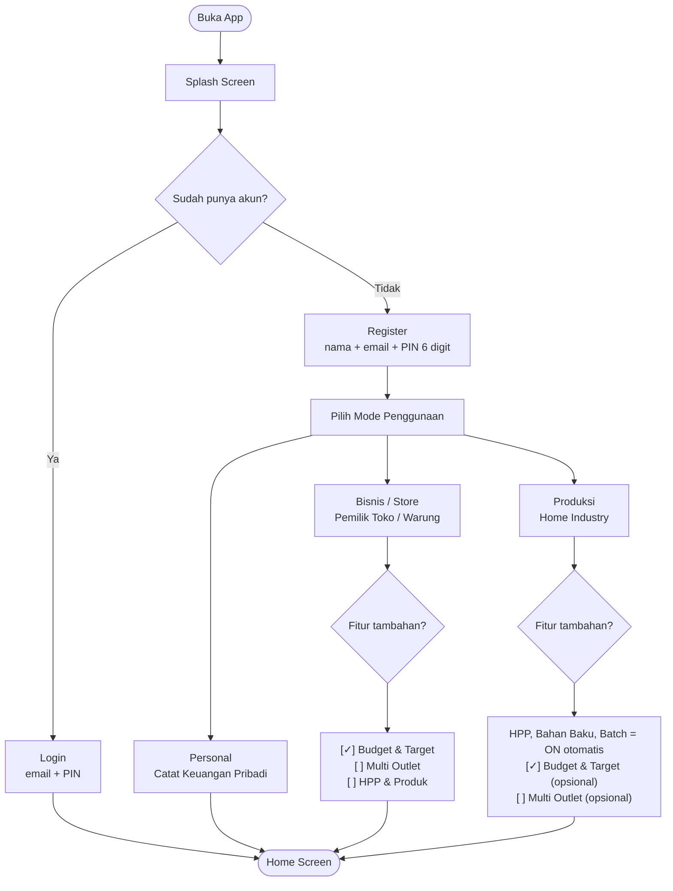

> **Ubah kapan saja:** Profil → Atur Fitur → toggle on/off

---

## 2. Flow Personal — Sehari-hari

### 2a. Cek Kondisi Keuangan (Pagi)

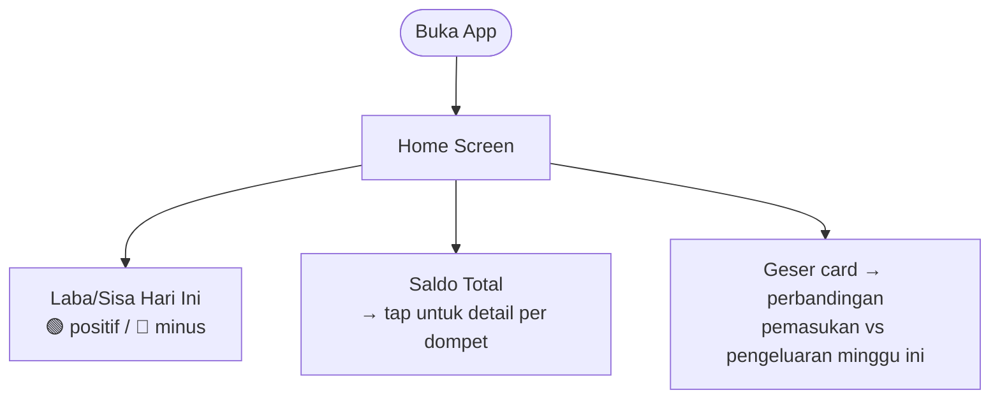

### 2b. Catat Pengeluaran

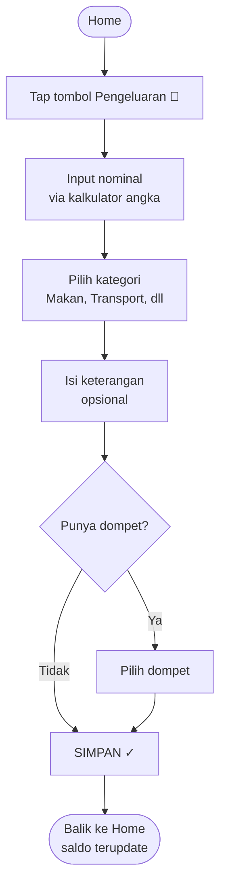

### 2c. Cek Laporan Akhir Bulan

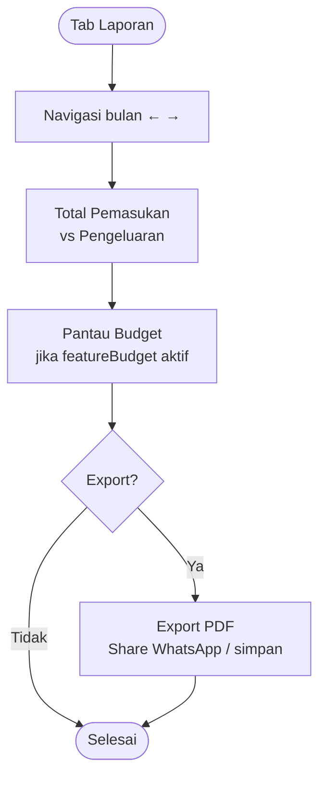

---

## 3. Flow Store (Bisnis/Kelontong) — Sehari-hari

### 3a. Buka Warung, Cek Kondisi

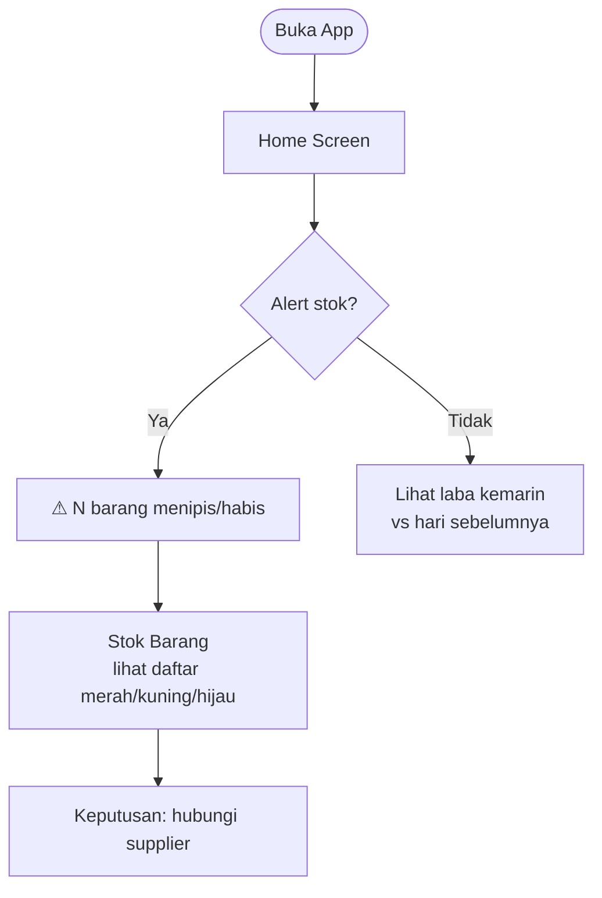

### 3b. Catat Penjualan (Jual Cepat — 2 Ketukan)

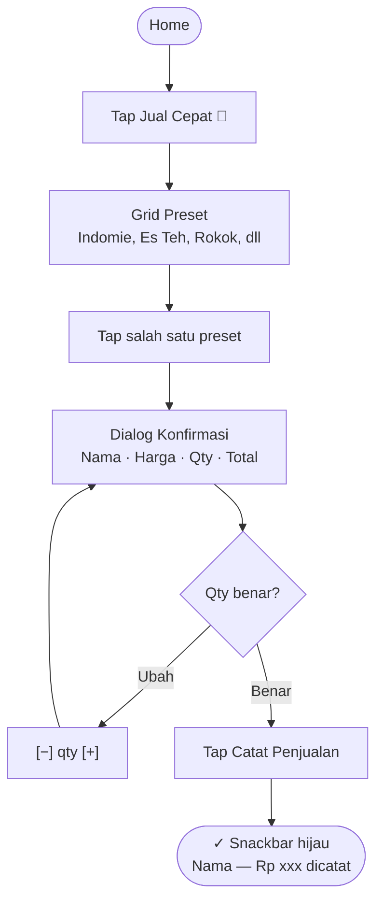

### 3c. Update Stok Saat Terima Supplier

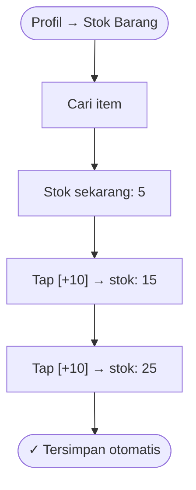

### 3d. Analisa Bisnis Akhir Bulan

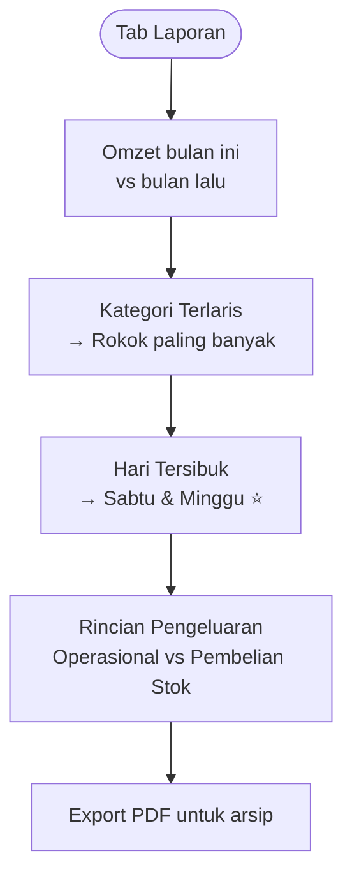

---

## 4. Flow Multi-outlet (Store + featureOutlets)

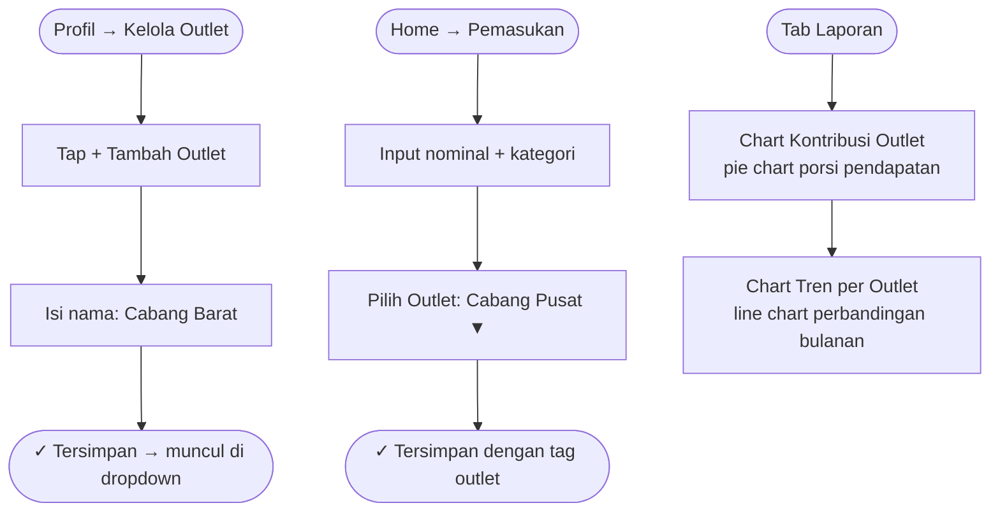

---

## 5. Flow Produksi (Mode Production)

### 5a. Kelola Bahan Baku

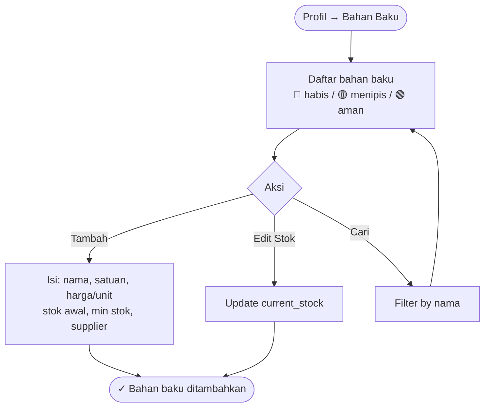

### 5b. Hitung HPP & Simpan Produk

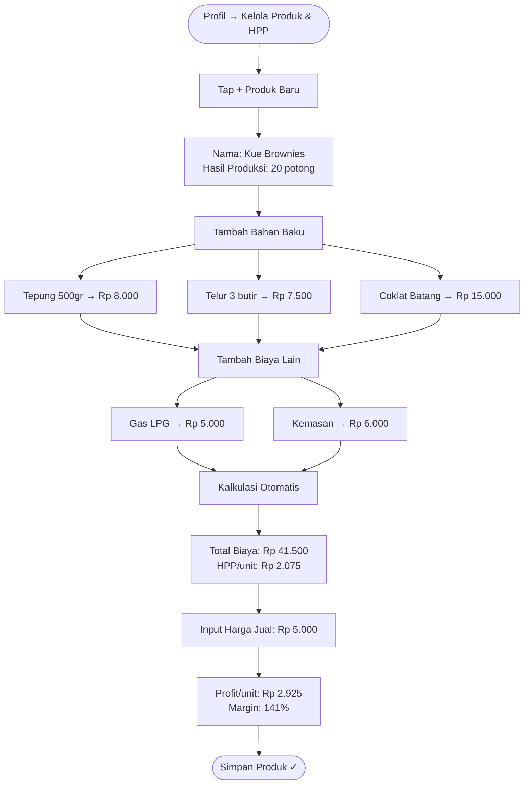

### 5c. Catat Batch Produksi

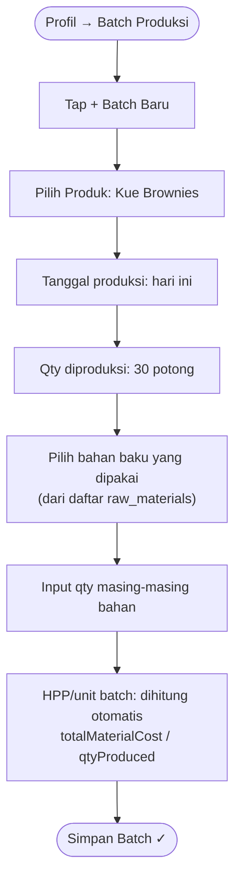

### 5d. Analitik Produk

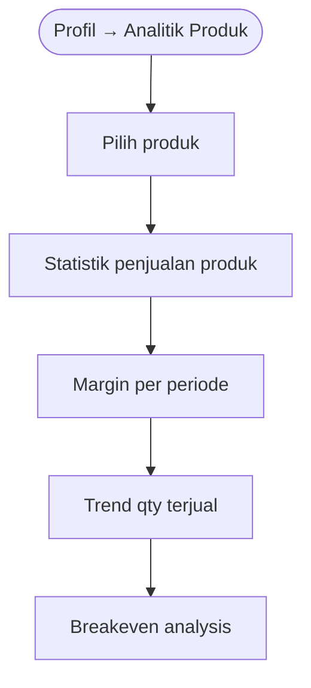

---

## 6. Flow Utang & Piutang

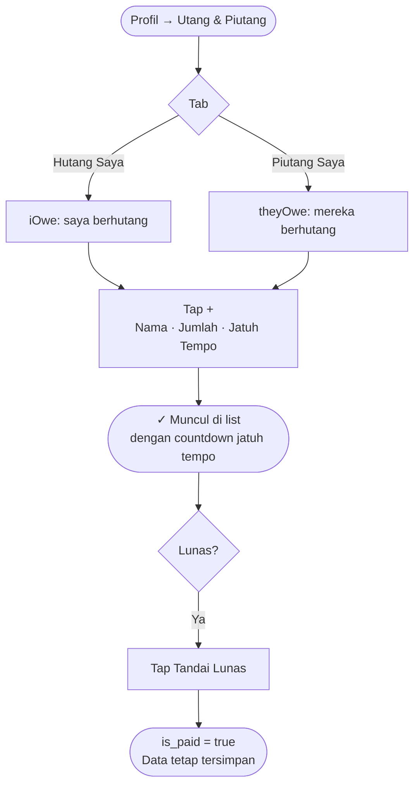

---

## 7. Flow Transaksi Berulang

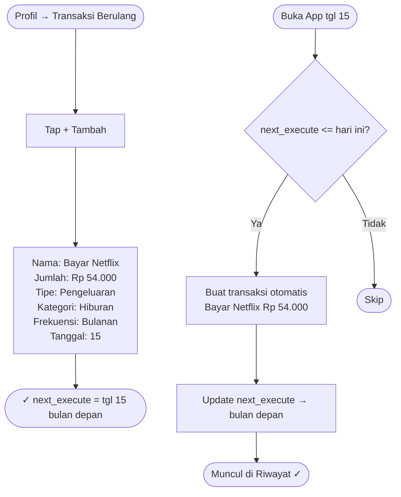

---

## 8. Flow Atur Fitur (Manage Features)

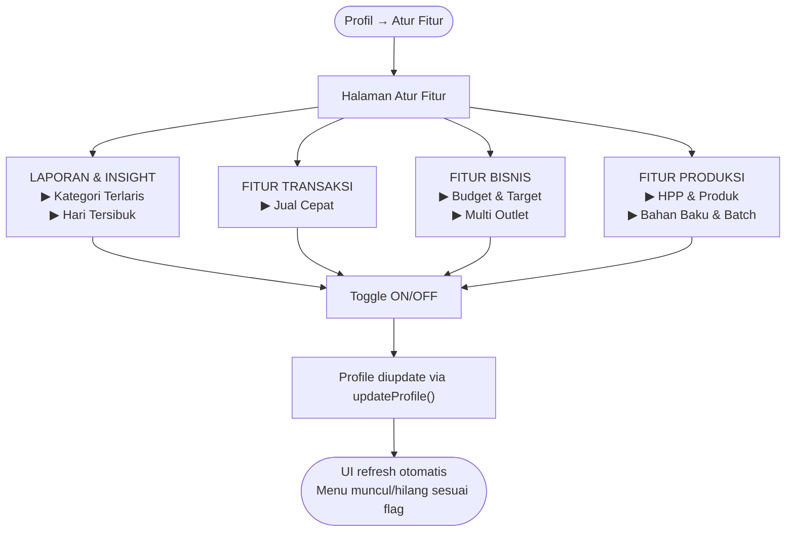

---

## 9. Navigasi App (Bottom Navigation)

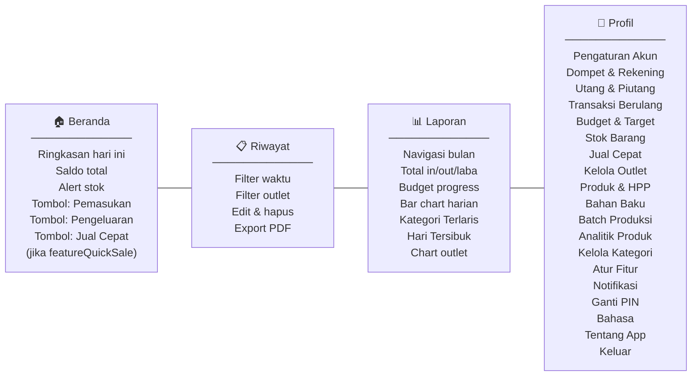

---

## 10. Alur Sinkronisasi Data

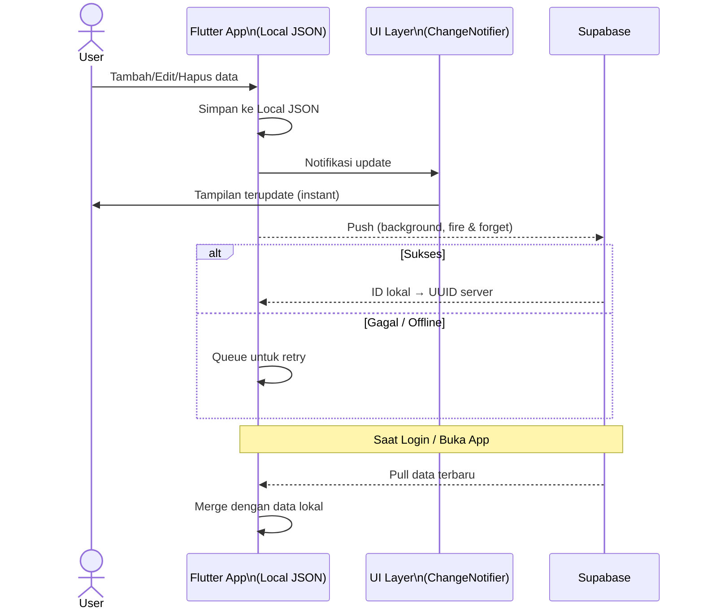

> **Prinsip:** App selalu bisa dipakai offline. Local = source of truth untuk UI. Supabase = backup & sync antar device.
